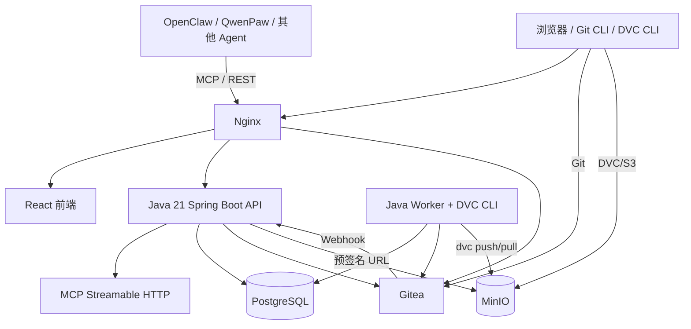
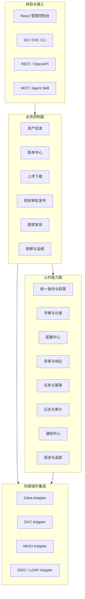
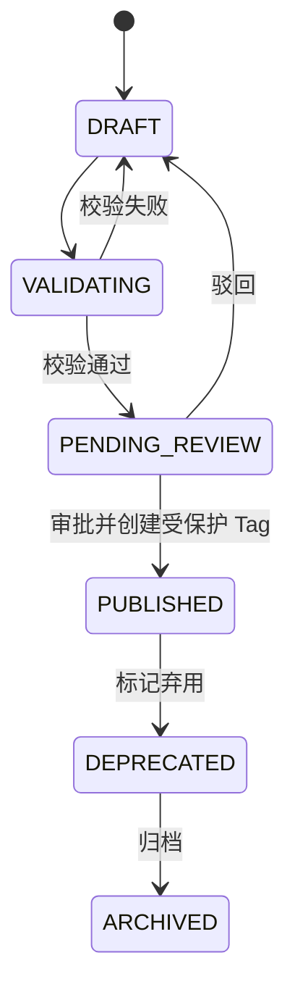

# 内部 AI 资产管理平台深度研究与设计说明书

> 文档版本：v2.1  
> 更新日期：2026-06-29  
> 目标读者：架构师、技术负责人、后端/前端工程师、平台运维人员  
> 核心技术路线：Gitea + DVC + MinIO + Java 21/Spring Boot/MyBatis-Plus + React  
> 部署与验收基线：Docker Compose

## 0. 执行摘要

本平台面向公司内部模型、数据集及其版本的统一登记、检索、授权、发布和分发，首期不建设训练平台和在线推理平台。平台采用以下技术分工：

- **Gitea**：管理资产仓库、代码、卡片、配置、DVC 指针、Git Commit 和 Tag。
- **DVC**：管理模型权重、数据集、多模态文件等大对象的内容版本及可复现依赖。
- **MinIO**：承载 DVC Remote、上传暂存区、预览文件及可选的 Gitea LFS 对象。
- **自研后端**：采用 **Java 21 + Spring Boot + MyBatis-Plus**，提供业务 API、权限、发布工作流、搜索索引、Gitea/MinIO/DVC 编排、MCP Server 和审计。
- **自研前端**：采用 **React + TypeScript**，提供模型与数据集的发现、详情、上传、版本、审批和接入配置页面。
- **PostgreSQL**：存储业务元数据、查询投影、权限、任务、审计和 Outbox 事件。

关键设计不是简单地把三个开源组件拼起来，而是明确四类“事实源”：

| 信息类型 | 权威事实源 | 说明 |
| --- | --- | --- |
| 代码、资产卡片、清单、版本标签 | Gitea | Git Commit/Tag 是可审计版本锚点 |
| 模型/数据集实际内容 | DVC + MinIO | DVC Hash 标识内容，MinIO 保存对象 |
| 业务状态、权限、搜索与统计 | PostgreSQL | 是查询和流程投影，不替代 Git/DVC 版本事实 |
| 临时上传与预览产物 | MinIO | 有生命周期策略，不属于正式版本 |

对 OpenClaw、QwenPaw 等 Agent 平台，平台同时提供：

1. **MCP Streamable HTTP**：用于标准化工具发现和调用；
2. **REST/OpenAPI**：用于完整业务集成和批量自动化；
3. **预签名 URL**：用于大文件直传直下，避免二进制经过 Agent 上下文或后端中转；
4. **Agent Skill 接入包**：提供 `SKILL.md`、调用约束、示例和最小权限模板。

首期通过 Docker Compose 部署 Gitea、MinIO、PostgreSQL、后端、任务 Worker、前端和 Nginx，并以“创建资产 → 上传 DVC 内容 → Git 提交 → 发布版本 → MCP 检索 → 下载校验”的端到端用例作为功能验收闭环。

---

## 1. 背景、目标与边界

### 1.1 背景

内部模型和数据集通常散落在个人目录、共享盘、对象存储、代码仓库和训练服务器中，容易产生以下问题：

- 不知道有哪些可复用资产，也不知道由谁维护；
- 同名文件无法对应到确定的模型或数据集版本；
- 模型权重、训练代码、配置和数据版本不能稳定关联；
- 大文件复制成本高，缺少内容去重和断点续传路径；
- Agent 只能“看见一个下载链接”，无法按结构化协议搜索、选择和授权访问资产；
- 发布、下线、审计和权限缺少统一控制面。

### 1.2 建设目标

平台首期应实现：

1. 统一管理 `MODEL` 和 `DATASET` 两类核心资产，并预留 `ADAPTER`、`EVALUATION`、`PROMPT_PACKAGE` 等扩展类型；
2. 以 Git Commit/Tag、DVC Hash 和发布记录共同确定一个不可歧义的资产版本；
3. 支持 Web、CLI、REST API、MCP 四类使用入口；
4. 支持模型卡、数据集卡、文件清单、版本说明、许可证、标签、负责人和可见性；
5. 支持组织、项目、资产级权限以及 Agent 服务账号；
6. 支持大文件直传、分片、校验、短期预签名下载和本地缓存；
7. 支持 OpenClaw、QwenPaw 等平台在 30 分钟内完成只读接入；
8. 提供可重复的 Docker Compose 部署与端到端验证脚本。

### 1.3 非目标

首期明确不包含：

- GPU 训练调度、超参数实验管理；
- 在线推理、弹性扩缩容和模型网关；
- Notebook 开发环境；
- 数据标注平台；
- 通用数据湖或湖仓；
- 跨地域多活和超大规模对象存储运维；
- 直接复刻 ModelScope/Hugging Face 的全部 SDK。

这些能力可以消费本平台发布的资产，但不应被塞进首期核心服务。

### 1.4 设计原则

- **版本事实可验证**：任一发布版本都能回溯到 Git Commit、Git Tag、DVC Hash 和文件校验和。
- **控制面与数据面分离**：元数据走后端 API，大文件通过 MinIO 预签名 URL 或 DVC 直传。
- **发布后不可变**：已发布版本不得覆盖；修改必须创建新版本。
- **后端不重造 Git/DVC**：后端负责协调和校验，不重新实现 Git 或 DVC 协议。
- **Agent 与人使用同一权限模型**：Agent 只是独立主体，不拥有隐式超级权限。
- **先标准协议，后专有适配**：优先 MCP、REST、OpenAPI、Git、S3，专有插件只做体验增强。
- **Compose 可验收，生产可演进**：Compose 是开发和小规模单机部署基线，不伪装成高可用方案。

---

## 2. 用户、场景与验收口径

### 2.1 角色

| 角色 | 主要能力 |
| --- | --- |
| 平台管理员 | 租户/组织、全局字典、存储策略、审计和系统配置 |
| 组织管理员 | 成员、团队、项目和组织内资产管理 |
| 资产维护者 | 创建草稿、上传内容、维护卡片、发起发布 |
| 审核者 | 审核版本、许可证、敏感级别和质量结果 |
| 普通用户 | 搜索、浏览、下载有权访问的资产 |
| Agent/服务账号 | 通过 MCP/REST 按 Scope 搜索、获取、上传或发布 |

### 2.2 核心场景

#### 场景 A：模型版本发布

```text
创建模型草稿
  → 自动创建 Gitea 仓库
  → 提交模型卡、配置和 DVC 指针
  → 权重通过 DVC 推送到 MinIO
  → Webhook 触发索引
  → 执行完整性与安全校验
  → 审批
  → 创建受保护 Git Tag
  → 形成不可变发布版本
```

#### 场景 B：数据集 Web 上传

```text
创建数据集草稿
  → 后端签发 MinIO 分片上传 URL
  → 浏览器直传暂存桶
  → 后端完成上传会话
  → Worker 校验并生成 DVC 指针
  → 推送 DVC Remote 和 Git Commit
  → 生成采样预览与统计
  → 发布
```

#### 场景 C：Agent 消费资产

```text
Agent 调用 asset_search
  → 获取最小元数据和候选版本
  → 调用 asset_get_version
  → 调用 asset_request_download
  → 获得短期预签名 URL 或 DVC/Git 拉取说明
  → 下载并校验 SHA-256
```

### 2.3 成功指标

| 指标 | MVP 目标 |
| --- | --- |
| 只读 Agent 接入时长 | 有账号和网络条件下 ≤ 30 分钟 |
| 元数据搜索 P95 | 10 万资产规模下 ≤ 500 ms |
| 预签名 URL 签发 P95 | ≤ 300 ms |
| Webhook 索引延迟 | P95 ≤ 10 秒 |
| 版本一致性 | 发布版本 100% 同时具备 Commit、Tag、DVC/Manifest 摘要 |
| 审计覆盖 | 写操作、下载授权、MCP 工具调用 100% 有记录 |
| Compose 验收 | 一条命令启动，端到端验证脚本全部通过 |
| AI Coding 一致性 | 合并变更 100% 通过契约、架构、迁移和测试门禁 |

### 2.4 标杆能力与 MVP 映射

平台参考 ModelScope/Hugging Face Hub 的资产卡片、版本选择、SDK/CLI 下载和组织协作体验，但不复制其公网社区运营能力。

| 标杆能力 | MVP 设计 | 后续增强 |
| --- | --- | --- |
| Model/Dataset Card | `asset.yaml` + `README.md` | 卡片模板市场、自动质量报告 |
| 版本选择 | Git Tag + Commit + DVC Digest | 版本别名、兼容性矩阵 |
| 多路径下载 | DVC/Git + 预签名 URL + REST/MCP | Python/Java SDK、本地缓存代理 |
| 数据集预览 | 脱敏样例、Schema、基础统计 | Parquet 流式查询和可视化分析 |
| 组织协作 | 组织/项目/资产 RBAC | 企业策略引擎、跨组织共享审批 |
| 搜索发现 | PostgreSQL 字段与全文搜索 | OpenSearch、语义检索和推荐 |
| Agent 接入 | MCP + OpenAPI + Skill | Agent 事件订阅和工作流编排 |

---

## 3. 技术选型与职责边界

### 3.1 技术基线

| 层次 | 推荐技术 | 选型说明 |
| --- | --- | --- |
| 后端运行时 | Java 21 | 企业内部长期维护基线 |
| Web 框架 | Spring Boot 4.1.x / Spring MVC | 当前稳定版本；具体 Patch 通过依赖锁定 |
| 数据访问 | MyBatis-Plus 3.5.x Boot 4 Starter | CRUD 与分页提效，复杂 SQL 保留 XML/手写 SQL |
| 数据库迁移 | Flyway | Schema 版本化，禁止应用启动时自动改表 |
| 安全 | Spring Security + OAuth2 Resource Server | 用户、Agent、MCP 统一 Bearer Token |
| MCP | Spring AI MCP Server WebMVC | 采用 Streamable HTTP；SSE 仅作为兼容路径 |
| API 文档 | springdoc-openapi | 输出 OpenAPI 3.1 和 Agent 友好 Schema |
| 数据库 | PostgreSQL 17 | 元数据、权限、任务、审计、Outbox |
| Git 服务 | Gitea | 组织、仓库、Commit、Tag、Webhook |
| 数据版本 | DVC 3.x + `dvc-s3` | 大文件和目录内容寻址、Remote 同步 |
| 对象存储 | MinIO | S3 兼容，承载 DVC、暂存和预览 |
| 前端 | React + TypeScript + Vite | 统一管理控制台 |
| UI/状态 | Ant Design + TanStack Query | 企业 UI 与服务端状态管理 |
| 网关 | Nginx | 单域名、TLS、路由、上传限制和安全头 |
| 观测 | Actuator + Micrometer + OpenTelemetry | 健康、指标、Trace 和审计关联 |

> 若公司内部基础框架仍基于 Spring Boot 3.5，可使用对应的 MyBatis-Plus Boot 3 Starter 和 Spring AI 兼容版本；领域模型和接口设计不变。禁止同时引入 MyBatis 官方 Starter 与 MyBatis-Plus Starter，避免依赖冲突。[R5]

### 3.2 Gitea

Gitea 负责：

- 一个资产对应一个 Git 仓库；
- 保存 `README.md`、`asset.yaml`、配置、脚本、`.dvc`、`dvc.yaml`、`dvc.lock`；
- 提供组织、仓库、分支、Tag、Commit、Webhook 和审计线索；
- 通过受保护分支/Tag 阻止绕过发布流程覆盖正式版本；
- 为高级用户提供原生 Git Clone/Pull/Push。

Gitea 不负责：

- 业务发布状态；
- 模型/数据集搜索投影；
- DVC 内容是否完整的业务校验；
- Agent 的 MCP Tool 权限；
- 大文件上传会话。

### 3.3 DVC

DVC 负责：

- 对模型权重、数据集目录、多模态文件生成内容摘要；
- 将大文件从 Git 历史中剥离；
- 通过 S3 兼容 Remote 连接 MinIO；
- 在需要时记录数据处理 Pipeline 的输入输出依赖；
- 允许用户按 Git Revision 拉取对应内容。

DVC 命令行依赖 Python 运行时，因此自研后端不直接实现 DVC 算法。平台采用两种模式：

1. **客户端原生模式（优先）**：用户或 Agent 本地执行 `dvc add/push` 和 `git push`；
2. **平台托管模式**：Java Worker 在受控容器中调用锁定版本的 DVC CLI，处理 Web 上传转存、校验和 Git 提交。

托管模式的 Worker 镜像虽然包含 Python/DVC 运行时，但业务服务和任务编排仍由 Java 21/Spring Boot 实现。

### 3.4 MinIO

MinIO 负责：

- `dvc-cache`：正式 DVC Remote；
- `asset-staging`：Web/REST 分片上传暂存；
- `asset-preview`：数据预览、缩略图、统计产物；
- `gitea-storage`：可选的 Gitea LFS/附件对象。

正式对象不由用户直接浏览 Bucket。下载必须通过 DVC 凭据、短期预签名 URL 或后端授权代理获得。

### 3.5 PostgreSQL

PostgreSQL 保存：

- 资产与版本查询投影；
- 组织、项目、业务角色、Agent、Scope；
- 发布申请、审批和状态机；
- 上传会话、后台任务、Webhook Inbox、Outbox；
- 下载授权和审计日志；
- 搜索字段、统计和展示配置。

PostgreSQL 中的模型/数据集元数据必须带 `source_commit` 和 `manifest_digest`。当数据库投影损坏时，应能从 Gitea + DVC 重建。

### 3.6 Git LFS 的定位

Git LFS 不是核心路径。默认策略为：

- 文本、JSON、YAML、Markdown、脚本直接进入 Git；
- 模型权重、数据集和较大二进制文件进入 DVC；
- 仅在外部工具强依赖 Git LFS 时开启 Gitea LFS 兼容。

避免同时用 LFS 和 DVC 追踪同一文件。Gitea 可将 LFS 存储配置到 MinIO，并支持通过签名 URL 直接服务对象，但这只作为兼容能力。[R2]

---

## 4. 总体架构

### 4.1 逻辑架构



### 4.2 控制面与数据面

| 平面 | 请求内容 | 路径 |
| --- | --- | --- |
| 控制面 | 搜索、元数据、版本、审批、权限、任务 | Agent/Browser → Backend → PostgreSQL/Gitea |
| 数据面 | 权重、数据文件、压缩包、预览文件 | Client ↔ MinIO |
| 版本面 | Commit、Tag、DVC 指针、Manifest | Client/Worker ↔ Gitea；DVC ↔ MinIO |

后端不得代理 GB/TB 级文件的完整数据流。后端只负责授权、签名、校验编排和状态更新。

### 4.3 后端模块

建议先采用模块化单体，避免首期拆分微服务：

```text
backend/
├─ bootstrap                 # Spring Boot 启动与配置
├─ module-identity           # 用户、Agent、Token、Scope
├─ module-organization       # 组织、项目、成员、角色
├─ module-asset              # 资产、卡片、标签、检索
├─ module-version            # Commit/Tag/DVC/Manifest、发布状态机
├─ module-transfer           # 上传会话、预签名 URL、下载授权
├─ module-integration-gitea  # Gitea Client、Webhook、对账
├─ module-integration-minio  # Bucket、签名、对象元信息
├─ module-job                # PostgreSQL 任务队列、Worker、重试
├─ module-mcp                # MCP Tools/Resources/Prompts
├─ module-audit              # 审计、Outbox、操作记录
└─ shared-kernel             # 错误码、鉴权上下文、ID、分页
```

模块内部按 `api/application/domain/infrastructure` 分层。Controller 不直接调用 Mapper，MCP Tool 也必须复用 Application Service，不能形成第二套业务逻辑。

### 4.4 前端模块

```text
frontend/src/
├─ app               # 路由、权限守卫、全局错误处理
├─ features/assets   # 模型/数据集列表与详情
├─ features/version  # 版本、Diff、发布、回滚视图
├─ features/upload   # 分片直传、断点续传、校验
├─ features/access   # 成员、Agent、Token、Scope
├─ features/integrations # OpenClaw/QwenPaw 接入向导
├─ features/admin    # 字典、存储、Webhook、任务
└─ shared            # API Client、组件、类型、Hooks
```

---

## 5. 平台功能能力设计

### 5.1 平台能力全景

平台能力分为业务控制面、公共能力面、集成面和基础设施面。业务模块不得各自实现用户、权限、字典、异常、日志、审计、任务和通知。



### 5.2 功能域与优先级

| 功能域 | 核心能力 | MVP | 增强阶段 |
| --- | --- | --- | --- |
| 资产目录 | 模型/数据集登记、卡片、标签、Owner、可见性 | 必须 | 扩展资产类型、推荐 |
| 版本中心 | Commit/Tag/DVC Digest、版本比较、弃用/归档 | 必须 | 版本别名、兼容矩阵 |
| 上传下载 | CLI/DVC、Multipart、预签名 URL、校验和 | 必须 | 边缘缓存、跨地域分发 |
| 发布治理 | 完整性校验、审批、受保护 Tag、不可变版本 | 必须 | 策略引擎、多级审批 |
| 搜索发现 | 字段检索、全文检索、权限过滤 | 必须 | 语义检索、推荐 |
| 依赖血缘 | Base Model、训练数据、派生版本关系 | 基础 | 可视化影响分析 |
| 身份权限 | 用户、Agent、服务账号、RBAC、Scope | 必须 | 条件策略、临时授权 |
| Agent 接入 | MCP、OpenAPI、Skill、Tool 白名单 | 必须 | 事件订阅、工作流 |
| 系统治理 | 字典、配置、国际化、通知、审计 | 必须 | 配置审批、运营报表 |
| 运维观测 | 健康、指标、Trace、任务、对账 | 必须 | 自动扩缩、容量预测 |

### 5.3 公共模块与依赖规则

后端公共模块建议进一步细分：

```text
shared-kernel
├─ api-contract          # ApiResponse、CursorPage、错误码、校验
├─ identity-contract     # Principal、PrincipalContext、Scope
├─ domain-contract       # 公共 ID、时间、事件、幂等接口
└─ observability-contract# Trace、审计注解、指标名称

platform
├─ platform-identity     # 用户、Agent、服务账号
├─ platform-authorization# RBAC、资源授权、Tool Scope
├─ platform-taxonomy     # 字典、标签、分类、国际化
├─ platform-configuration# 非敏感运行配置
├─ platform-job          # 持久化任务、重试、租约
├─ platform-audit        # 审计、操作日志
├─ platform-notification # 站内信、Webhook、邮件适配
└─ platform-observability# 指标、Trace、健康和诊断
```

依赖方向：

```text
业务模块 → shared-kernel / platform 公共接口
platform 实现 → shared-kernel
integration adapter → 业务模块定义的 Port
shared-kernel 禁止依赖任何业务模块和基础设施 SDK
```

业务模块之间不允许直接访问对方 Mapper。跨模块查询通过 Application Service、只读 Query Port 或领域事件完成。

### 5.4 统一访问主体

所有访问者统一抽象为 `Principal`：

| 类型 | 说明 | 认证方式 |
| --- | --- | --- |
| `USER` | 企业普通用户和管理员 | OIDC/LDAP |
| `AGENT` | OpenClaw、QwenPaw、自研 Agent | OAuth2/Agent Token |
| `SERVICE` | 后端内部服务或外部业务系统 | Client Credentials |
| `API_CLIENT` | SDK、CI/CD、批处理客户端 | OAuth2/PAT |
| `WORKER` | 平台受控后台 Worker | 工作负载身份 |

`ADMIN` 是角色，不是 Principal 类型；Skill 只有在拥有独立凭据并直接调用平台时才注册为 `SERVICE` 或 `AGENT`，避免身份类型无限膨胀。

统一上下文：

```text
PrincipalContext
├─ principalId
├─ principalType
├─ subject
├─ organizationId
├─ projectIds
├─ roles
├─ scopes
├─ maxSensitivityLevel
├─ locale
├─ requestId
└─ traceId
```

约束：

- 业务代码只通过 `PrincipalContextHolder` 获取当前主体；
- Controller、MCP Tool 和 Worker 入口统一建立上下文；
- 业务模块禁止解析 JWT、Cookie、Gitea Token 或 Agent Token；
- Agent 必须独立注册，不得复用管理员或开发者 Token；
- Token 只保存不可逆摘要、前缀、到期时间和最后使用时间；
- 禁用 Principal 后，其 Token、会话和未执行写任务必须同步失效或冻结。

### 5.5 统一权限模型

采用组合授权：

```text
RBAC
+ Organization / Project Membership
+ Asset ACL
+ OAuth Scope / MCP Tool Allowlist
+ Sensitivity and Visibility Policy
+ Operation Preconditions
```

一次授权判断至少包含：

```text
principal + action + resource + scope + resourceState + environment
```

示例：

```text
AGENT agt_xxx
申请 asset:download
目标 ast_xxx@1.2.0
作用域 prj_xxx
资产敏感等级 INTERNAL
版本状态 PUBLISHED
```

权限编码统一为 `resource:action`：

```text
organization:manage
project:view
project:manage
asset:create
asset:read
asset:update
asset:upload
asset:download
asset:submit
asset:review
asset:publish
asset:deprecate
asset:delete
agent:register
agent:authorize
token:create
audit:read
system:configure
mcp:invoke
```

OAuth Scope 是对客户端能力的粗粒度授权，业务 Permission 是资源级细粒度授权。示例：`asset:write` Scope 可映射到 `asset:create`、`asset:update` 和 `asset:upload`，但最终操作仍需通过角色、作用域、资产状态和策略判断。Scope 不能直接替代 Permission。

权限实现要求：

- 所有 REST、MCP 和后台命令复用 `AuthorizationService`；
- 查询列表必须在数据库查询阶段做权限过滤，禁止“先查全量再在 Java 中过滤”；
- 资源不存在和无权访问私有资源对外均可返回 `ASSET_NOT_FOUND`，防止枚举；
- `asset:publish`、`asset:delete`、`system:configure` 默认不授予 Agent；
- 下载授权同时检查资产权限、版本状态、敏感等级和用途限制；
- Gitea 权限由后端单向投影，不能代替业务授权判断。

### 5.6 字典、枚举、标签与国际化

平台将“稳定领域枚举”和“可运营分类”分开管理。

#### 代码级稳定枚举

以下内容直接影响状态机和业务分支，必须定义为 Java Enum、数据库约束和前端生成类型，不能在运行时随意新增：

```text
AssetType
AssetStatus
VersionStatus
PrincipalType
UploadSessionStatus
JobStatus
PublishDecision
Visibility
```

#### 可配置字典与分类

以下内容允许管理员维护：

```text
model_task
model_framework
dataset_modality
dataset_format
industry_tag
license_catalog
sensitivity_level
deprecation_reason
```

使用规则：

- 数据库存稳定 `itemCode`，不存展示文案；
- 前端按 `i18nKey` 展示；
- 禁止业务逻辑依据 `itemName` 判断；
- 字典项停用不影响已有资产回显，但禁止新建时继续选择；
- 字典变更需要版本号和审计；
- License、敏感等级等治理字典的修改需要管理员权限。

国际化范围包括菜单、按钮、字典项、错误消息、通知模板和接入向导。接口字段采用 camelCase；错误分支依赖稳定 `code`，不依赖本地化 `message`。首期支持 `zh-CN` 和 `en-US`。

### 5.7 统一配置

配置分为：

| 层级 | 示例 | 存储 |
| --- | --- | --- |
| 构建期 | Maven/npm/DVC 版本、镜像 Digest | Git 与锁文件 |
| 部署期 | 数据源、Gitea/MinIO Endpoint、OIDC Issuer | 环境变量/Secret |
| 运行期 | 上传限额、URL 有效期、重试次数、功能开关 | `system_config` |
| 作用域配置 | 项目配额、Agent Tool Allowlist | 业务配置表 |

配置 Key 示例：

```text
transfer.web.maxSessionBytes
transfer.presignedUrl.ttlSeconds
version.publish.requireApproval
job.dvc.maxRetries
job.webhook.maxRetries
mcp.maxResultItems
mcp.writeTools.enabled
security.agentToken.maxTtlSeconds
audit.retentionDays
notification.webhook.enabled
```

约束：

- 密码、Token、私钥不得写入 `system_config`；
- 配置项具有类型、默认值、校验器、作用域、是否可热更新等元数据；
- 关键配置变更需要审计，安全和发布策略变更需要二次确认；
- 不支持热更新的配置必须明确提示重启；
- 业务代码通过类型安全的配置对象读取，不散落字符串 Key。

### 5.8 统一 ID、请求上下文、响应与分页

公共 ID 采用“业务前缀 + ULID”：

| 对象 | 前缀 | 示例 |
| --- | --- | --- |
| Principal | `prn_` | `prn_01J...` |
| User | `usr_` | `usr_01J...` |
| Agent | `agt_` | `agt_01J...` |
| Organization | `org_` | `org_01J...` |
| Project | `prj_` | `prj_01J...` |
| Asset | `ast_` | `ast_01J...` |
| Version | `ver_` | `ver_01J...` |
| Upload Session | `upl_` | `upl_01J...` |
| Job | `job_` | `job_01J...` |
| Audit | `aud_` | `aud_01J...` |

数据库内部可使用 `BIGINT` 主键优化关联，公共接口只暴露业务 ID。禁止用数据库自增 ID 作为跨系统标识。

所有入口统一生成或接收：

```text
X-Request-Id
traceparent
Idempotency-Key（写接口按需）
Accept-Language
```

统一成功响应：

```json
{
  "data": {},
  "requestId": "req_01J...",
  "traceId": "4bf92f3577b34da6a3ce929d0e0e4736",
  "timestamp": "2026-06-29T08:00:00Z"
}
```

统一失败响应：

```json
{
  "code": "ASSET_VERSION_CONFLICT",
  "message": "Version already exists",
  "i18nKey": "error.asset.versionConflict",
  "details": {},
  "retryable": false,
  "requestId": "req_01J...",
  "traceId": "4bf92f3577b34da6a3ce929d0e0e4736"
}
```

分页分两类：

- 资产检索、审计、任务等高增长列表使用 `CursorPage<T>`；
- 小型后台字典和角色列表可使用 `PageResult<T>`。

排序字段必须使用服务端白名单映射，禁止将客户端 `sortBy` 直接拼接到 SQL。

### 5.9 统一异常与错误码

异常层次：

```text
PlatformException
├─ ValidationException       # 400
├─ AuthenticationException   # 401
├─ AuthorizationException    # 403
├─ NotFoundException         # 404
├─ ConflictException         # 409
├─ RateLimitException        # 429
├─ DependencyException       # 502/503
└─ InternalException         # 500
```

错误码按语义命名，不使用仅靠数字区间猜含义的方式：

```text
COMMON_INVALID_ARGUMENT
AUTH_TOKEN_EXPIRED
AUTH_PERMISSION_DENIED
ASSET_NOT_FOUND
ASSET_VERSION_CONFLICT
VERSION_STATE_NOT_ALLOWED
UPLOAD_SESSION_EXPIRED
DVC_OBJECT_MISSING
GITEA_DEPENDENCY_UNAVAILABLE
MINIO_DEPENDENCY_UNAVAILABLE
MCP_TOOL_NOT_ALLOWED
JOB_RETRY_EXHAUSTED
```

错误码必须集中定义，并包含 HTTP Status、默认 i18nKey、是否可重试和告警等级。Controller/MCP Tool 不捕获后返回伪成功；未知异常不得向客户端暴露堆栈、SQL、Bucket 或内部 URL。

### 5.10 统一日志与审计

日志分类：

```text
应用运行日志
HTTP/MCP 访问日志
业务操作日志
可靠任务日志
Gitea Webhook 日志
依赖调用日志
安全日志
审计日志
```

结构化日志公共字段：

```text
timestamp, level, service, module
traceId, spanId, requestId
principalType, principalId
organizationId, projectId, assetId, versionId, jobId
action, result, errorCode, durationMs
```

公共字段由 Filter/Interceptor、TaskDecorator 和 OpenTelemetry 自动注入，业务代码不得手工拼接。

必须审计：

- 登录失败、Token 创建/吊销、Agent 注册/授权；
- 成员、角色、ACL 和 Tool Allowlist 变更；
- 资产创建、修改、上传、下载授权、删除；
- 版本提交、审批、发布、弃用、Tag 操作；
- 系统配置、治理字典、Webhook 和存储策略变更；
- MCP 写工具及被拒绝的高风险工具调用；
- 后台人工重试、跳过、补偿和对账修复。

审计记录不可由普通管理员修改或删除；请求参数按字段级规则脱敏，禁止记录 Token、密码、预签名查询串和完整敏感样本。

### 5.11 统一异步任务与并发

异步工作分为两类：

| 类型 | 示例 | 实现 |
| --- | --- | --- |
| 可靠任务 | DVC 转存、发布、Webhook 消费、对账、预览生成 | PostgreSQL `job_task` + Worker |
| 进程内短任务 | 审计批量发送、非关键通知、轻量缓存刷新 | 统一受管 Executor |

可靠任务要求：

- 任务状态、租约、重试次数、下次执行时间持久化；
- 通过 `FOR UPDATE SKIP LOCKED` 领取；
- Handler 必须幂等；
- 重试采用指数退避和随机抖动；
- 进程崩溃后租约到期可重新领取；
- 超过阈值进入 `DEAD` 并通知；
- 全链路传递 `traceId`、`principalId`、`assetId`。

禁止：

- 业务模块直接 `new Thread` 或创建未注册线程池；
- 用 `@Async` 承担不能丢的发布/DVC 任务；
- 在线程池队列满时静默丢弃任务；
- 在数据库事务提交前启动依赖该事务结果的异步任务；
- Worker 通过无限重试掩盖不可恢复错误。

受管 Executor 至少分为 `ioExecutor`、`notificationExecutor`、`auditExecutor` 和 `schedulerExecutor`，并暴露活跃数、队列深度、完成数、拒绝数和耗时。

### 5.12 统一通知

通知事件：

```text
VERSION_REVIEW_REQUESTED
VERSION_APPROVED
VERSION_REJECTED
VERSION_PUBLISHED
VERSION_DEPRECATED
UPLOAD_FAILED
JOB_DEAD
AGENT_ACCESS_DENIED
STORAGE_QUOTA_WARNING
SYSTEM_DEPENDENCY_UNHEALTHY
```

渠道：

- 站内通知；
- 邮件；
- Webhook；
- 企业 IM 适配器；
- Agent Callback。

通知基于 Outbox 异步发送，模板与渠道解耦。失败不回滚已经完成的核心业务事务，但必须重试和可观测。Webhook 带签名、时间戳、Delivery ID，并防止 SSRF。

### 5.13 统一可观测性

监控覆盖：

| 分类 | 关键指标 |
| --- | --- |
| API | 请求数、P95/P99、错误率、状态码、限流 |
| MCP | Tool 调用数、延迟、错误、拒绝、响应体大小 |
| 任务 | Pending/Running/Dead、重试、租约过期、耗时 |
| Gitea | API 延迟、Webhook 积压、对账差异 |
| MinIO/DVC | 上传下载字节、错误、DVC Push/Pull 耗时 |
| 数据库 | 连接池、慢查询、锁等待、任务领取冲突 |
| JVM | Heap、GC、线程、CPU、文件句柄 |
| 业务 | 资产数、发布成功率、校验失败率、下载授权数 |

技术基线：

```text
Spring Boot Actuator
Micrometer
OpenTelemetry
Prometheus
Grafana
Loki / OpenSearch（按部署环境选择）
```

Trace 必须覆盖 Browser/Agent → Nginx → REST/MCP → Application Service → PostgreSQL/Gitea/MinIO → Worker。异步任务通过持久化 Trace Context 建立新 Span Link，不伪造父子关系。

### 5.14 平台管理 API 与页面

公共 API：

```http
GET    /api/v1/system/principals
GET    /api/v1/system/users
GET    /api/v1/system/agents
POST   /api/v1/system/agents
POST   /api/v1/system/agents/{agentId}:enable
POST   /api/v1/system/agents/{agentId}:disable
PUT    /api/v1/system/agents/{agentId}/tool-allowlist

GET    /api/v1/system/roles
GET    /api/v1/system/permissions
PUT    /api/v1/system/role-bindings/{bindingId}

GET    /api/v1/system/dictionaries
GET    /api/v1/system/dictionaries/{dictCode}/items
POST   /api/v1/system/dictionaries/{dictCode}/items

GET    /api/v1/system/configurations
PUT    /api/v1/system/configurations/{configKey}

GET    /api/v1/system/jobs
POST   /api/v1/system/jobs/{jobId}:retry
POST   /api/v1/system/jobs/{jobId}:cancel

GET    /api/v1/system/audit-logs
GET    /api/v1/system/notifications
POST   /api/v1/system/notifications/{notificationId}:read
GET    /api/v1/system/metrics/summary
GET    /api/v1/system/dependencies
```

管理页面：

```text
/admin/users
/admin/agents
/admin/roles
/admin/permissions
/admin/dictionaries
/admin/configurations
/admin/jobs
/admin/audit-logs
/admin/notifications
/admin/dependencies
```

所有管理 API 都需要细粒度权限，`/system/dependencies` 对非管理员隐藏内部 Endpoint、凭据状态和网络拓扑。

### 5.15 公共能力数据表

| 表 | 用途 |
| --- | --- |
| `iam_principal` | 统一主体 |
| `iam_user` | 用户扩展 |
| `iam_agent` | Agent 扩展与最大敏感等级 |
| `iam_role` | 角色 |
| `iam_permission` | 权限定义 |
| `iam_role_permission` | 角色权限 |
| `iam_role_binding` | 主体在作用域内的角色 |
| `iam_resource_acl` | 资产等资源的显式 ACL |
| `iam_agent_tool` | Agent MCP Tool 白名单 |
| `iam_token` | Token 摘要、Scope、状态与过期时间 |
| `system_dict_type` | 字典类型 |
| `system_dict_item` | 字典项和 i18nKey |
| `system_i18n_message` | 可运营国际化文案 |
| `system_config` | 非敏感运行配置 |
| `job_task` | 可靠任务 |
| `job_attempt` | 每次执行与错误 |
| `api_idempotency` | 写接口幂等结果 |
| `notification` | 通知 |
| `webhook_delivery` | 对外 Webhook 发送记录 |
| `audit_log` | 不可变审计 |
| `webhook_inbox` | Gitea Webhook 幂等 Inbox |
| `outbox_event` | 可靠事件 |

Flyway Migration 是表结构唯一变更入口；MyBatis-Plus Entity 不能反向自动生成或修改生产表。

### 5.16 公共能力设计结论

1. User、Agent、Service、API Client 和 Worker 统一为 Principal；
2. REST、MCP、Worker 复用同一 Application Service、权限和审计；
3. 关键状态使用代码级枚举，可运营分类使用字典，二者不得混用；
4. Secret 属于部署安全配置，不进入数据库配置中心；
5. 可靠任务必须持久化，线程池只承担可重建的短任务；
6. API、任务和依赖调用统一传递 Request/Trace/Principal 上下文；
7. 数据库指标不替代 Prometheus，审计日志不等同于运行日志；
8. 公共能力只实现一次，并通过模块依赖、测试和 CI 强制执行。

---

## 6. 资产、仓库与版本设计

### 6.1 统一资产标识

统一标识格式：

```text
aih://{namespace}/{assetType}/{name}@{version}
```

示例：

```text
aih://nlp/model/qwen-domain-7b@1.2.0
aih://vision/dataset/defect-images@2026.06
```

内部使用不可变 `asset_id` 和 `version_id`；`namespace/type/name` 可作为人类可读别名，但重命名后应保留旧别名跳转。

### 6.2 仓库约定

每个资产仓库至少包含：

```text
.
├─ README.md              # Model Card 或 Dataset Card
├─ asset.yaml             # 平台可机器读取的资产清单
├─ CHANGELOG.md           # 版本变更
├─ data.dvc               # 数据集目录指针，可选
├─ model.dvc              # 模型权重目录指针，可选
├─ dvc.yaml               # Pipeline，可选
├─ dvc.lock               # Pipeline 锁定，可选
├─ config/                # 模型/数据处理配置
├─ src/                   # 加载或转换脚本，可选
└─ samples/               # 小型、脱敏、可直接入 Git 的样例
```

`asset.yaml` 示例：

```yaml
schemaVersion: aihub/v1
kind: Model
metadata:
  namespace: nlp
  name: qwen-domain-7b
  displayName: 领域问答模型
  visibility: internal
  owners:
    - team-nlp
  tags:
    - text-generation
spec:
  framework: pytorch
  task: text-generation
  license: Apache-2.0
  artifacts:
    - path: model
      dvcFile: model.dvc
      mediaType: application/x-safetensors
  derivedFrom:
    - aih://base/model/qwen-base@1.0.0
```

平台发布校验以 `asset.yaml` 为机器事实，以 `README.md` 为人类说明。两者冲突时禁止发布。

### 6.3 模型扩展字段

- 框架、任务、架构、参数规模、精度；
- 权重格式及分片；
- Base Model、训练数据集、评估结果；
- 推理所需最小运行时和示例；
- License、使用限制和已知风险；
- 推荐加载入口和依赖文件。

### 6.4 数据集扩展字段

- 数据格式、模态、语言、Split；
- 行数/样本数、总大小、Schema；
- 采集来源、许可证、敏感级别；
- 质量指标、去重比例、脱敏状态；
- 生成或清洗 Pipeline；
- 样例预览策略。

### 6.5 版本三元组

每个正式版本必须保存：

```text
Git Tag + Git Commit SHA + Manifest/DVC Digest
```

其中：

- **Git Tag**：用户可读版本，如 `v1.2.0`；
- **Commit SHA**：卡片、配置和 DVC 指针的精确快照；
- **Manifest/DVC Digest**：正式文件清单及内容摘要。

仅有数据库中的 `version=1.2.0` 不构成有效版本。

### 6.6 状态机



约束：

- `PUBLISHED` 版本内容不可覆盖；
- `DEPRECATED` 仍允许已授权用户下载，但默认搜索降权；
- `ARCHIVED` 默认不返回，管理员可恢复元数据；
- 删除资产采用软删除；对象回收必须经过引用检查和保留期。

### 6.7 发布原子性

发布是跨 PostgreSQL、Gitea 和 MinIO 的分布式操作，不能依赖本地数据库事务覆盖全部系统。采用 Saga + Outbox：

1. 数据库锁定草稿版本并创建 `publish_job`；
2. 校验 Gitea Commit、DVC 对象和 Manifest；
3. 调用 Gitea 创建受保护 Tag；
4. 写入正式版本记录和 Outbox；
5. 异步更新搜索、统计和通知；
6. 任一步失败均保留可重试状态，禁止出现“数据库已发布但 Tag 不存在”；
7. 定时对账任务修复 Webhook 丢失和外部手工变更。

---

## 7. 数据模型

### 7.1 核心表

| 表 | 关键字段 | 说明 |
| --- | --- | --- |
| `iam_principal` | `id,principal_id,type,subject,status` | 用户/Agent/服务统一主体 |
| `iam_user` | `principal_id,username,display_name,email` | 用户扩展 |
| `iam_agent` | `principal_id,agent_type,vendor,max_sensitivity` | Agent 扩展 |
| `iam_role` | `id,role_code,role_name,role_type` | 角色 |
| `iam_permission` | `id,permission_code,resource,action` | 权限定义 |
| `iam_role_permission` | `role_id,permission_id` | 角色权限 |
| `iam_role_binding` | `principal_id,scope_type,scope_id,role_id` | 平台/组织/项目/资产授权 |
| `iam_agent_tool` | `principal_id,tool_name,enabled` | MCP Tool 白名单 |
| `iam_token` | `principal_id,token_digest,scopes,expires_at` | Token 摘要与生命周期 |
| `organization` | `id,code,name,gitea_org` | 组织映射 |
| `project` | `id,org_id,code,name` | 业务隔离单元 |
| `asset` | `id,type,namespace,name,status,visibility` | 统一资产 |
| `asset_model` | `asset_id,framework,task,architecture` | 模型扩展 |
| `asset_dataset` | `asset_id,format,modality,schema_json` | 数据集扩展 |
| `asset_version` | `id,asset_id,version,status,commit_sha,tag` | 版本控制面 |
| `asset_artifact` | `version_id,path,dvc_hash,sha256,size` | 正式文件清单 |
| `asset_relation` | `source_version_id,target_version_id,type` | 血缘/派生关系 |
| `upload_session` | `id,asset_id,state,expires_at` | 分片上传会话 |
| `upload_part` | `session_id,part_no,etag,size` | 分片记录 |
| `publish_request` | `version_id,status,reviewer_id` | 发布审批 |
| `job_task` | `type,payload,status,retry_count,next_run_at` | PostgreSQL 任务队列 |
| `job_attempt` | `job_id,attempt_no,result,error_code` | 任务执行历史 |
| `api_idempotency` | `principal_id,idempotency_key,request_hash,response` | 写接口幂等 |
| `notification` | `receiver_id,event_type,status` | 站内通知 |
| `webhook_inbox` | `delivery_id,event_type,payload,status` | Webhook 幂等消费 |
| `outbox_event` | `aggregate_id,type,payload,published_at` | 可靠事件 |
| `audit_log` | `principal_id,action,resource,result,trace_id` | 安全审计 |

系统字典、国际化和配置表见 5.15。资产领域 Migration 与平台公共能力 Migration 分目录维护，但统一由同一个 Flyway History 管理执行顺序。

### 7.2 关键约束

- `asset(namespace, type, name)` 唯一；
- `asset_version(asset_id, version)` 唯一；
- `asset_version(asset_id, tag)` 唯一；
- `webhook_inbox(delivery_id)` 唯一；
- 发布态必须满足 `commit_sha/tag/manifest_digest` 非空；
- `asset_artifact(version_id,path)` 唯一；
- 写接口支持 `Idempotency-Key`，数据库保存请求摘要和响应；
- 所有时间使用 UTC；
- 可编辑聚合使用乐观锁；资产等需要恢复的对象使用逻辑删除；
- 审计、Inbox、Outbox、任务执行记录等追加型表禁止逻辑覆盖历史。

### 7.3 MyBatis-Plus 使用边界

适合使用 MyBatis-Plus 的位置：

- 单表 CRUD；
- 条件构造、分页和乐观锁；
- 通用审计字段填充；
- 简单字典和后台管理。

必须使用显式 SQL 的位置：

- 权限闭包查询；
- 搜索排序；
- `FOR UPDATE SKIP LOCKED` 任务领取；
- Webhook/Outbox 幂等；
- 发布一致性校验；
- 复杂报表。

---

## 8. 后端接口设计

### 8.1 REST 资源

统一前缀：`/api/v1`

```http
# 资产
POST   /assets
GET    /assets
GET    /assets/{assetId}
PATCH  /assets/{assetId}
DELETE /assets/{assetId}

# 兼容型语义入口
GET    /models
GET    /datasets

# 版本
POST   /assets/{assetId}/versions
GET    /assets/{assetId}/versions
GET    /assets/{assetId}/versions/{version}
POST   /assets/{assetId}/versions/{version}:validate
POST   /assets/{assetId}/versions/{version}:submit
POST   /assets/{assetId}/versions/{version}:approve
POST   /assets/{assetId}/versions/{version}:deprecate

# 文件和下载
GET    /assets/{assetId}/versions/{version}/artifacts
POST   /assets/{assetId}/versions/{version}/download-tickets

# 上传
POST   /assets/{assetId}/upload-sessions
POST   /upload-sessions/{sessionId}/parts:sign
POST   /upload-sessions/{sessionId}:complete
GET    /upload-sessions/{sessionId}
DELETE /upload-sessions/{sessionId}

# 集成
GET    /integrations/agent-bundle
POST   /tokens
DELETE /tokens/{tokenId}
```

动词动作使用 `:validate`、`:submit` 等显式操作，避免用 `PATCH status` 绕过状态机。

### 8.2 统一响应

成功：

```json
{
  "data": {},
  "requestId": "req_01J...",
  "traceId": "4bf92f3577b34da6a3ce929d0e0e4736",
  "timestamp": "2026-06-29T08:00:00Z"
}
```

失败：

```json
{
  "code": "ASSET_VERSION_CONFLICT",
  "message": "Version 1.2.0 already exists",
  "i18nKey": "error.asset.versionConflict",
  "details": {
    "assetId": "ast_01J..."
  },
  "retryable": false,
  "requestId": "req_01J...",
  "traceId": "4bf92f3577b34da6a3ce929d0e0e4736"
}
```

Agent 不应依赖中文 `message` 做分支判断，只依赖稳定的 `code` 和 `retryable`。

### 8.3 搜索

首期使用 PostgreSQL：

- 精确字段：类型、Namespace、Owner、License、Framework、Task、状态；
- 全文字段：名称、描述、标签、卡片摘要；
- 默认只返回有权访问且状态为 `PUBLISHED` 的版本；
- 分页采用 Cursor，避免深分页；
- 返回小体积摘要，文件列表按需查询。

当资产规模或多语言检索超过 PostgreSQL 能力后，再引入 OpenSearch；API 不变。

### 8.4 上传策略

#### CLI/DVC 路径

适合大目录、TB 级数据和研发用户：

```bash
git clone https://git.example.com/nlp/qwen-domain-7b.git
cd qwen-domain-7b
dvc remote add -d internal s3://dvc-cache/nlp/qwen-domain-7b
dvc remote modify internal endpointurl https://minio.example.com
dvc remote modify --local internal access_key_id "$DVC_ACCESS_KEY"
dvc remote modify --local internal secret_access_key "$DVC_SECRET_KEY"
dvc add model/
dvc push
git add model.dvc .gitignore asset.yaml README.md
git commit -m "feat: add model artifacts"
git push
```

敏感凭据必须写入被 Git 忽略的 `.dvc/config.local` 或环境变量，不能进入仓库。[R3]

#### Web/REST 路径

适合办公用户和中等规模文件：

1. 创建 `upload_session`；
2. 后端返回 MinIO Multipart 预签名 URL；
3. 浏览器直接上传；
4. 完成会话后由 Worker 流式校验；
5. Worker 执行 DVC Add/Push、更新 Manifest 并提交 Git；
6. 暂存对象在成功后按生命周期回收。

Web 路径会产生一次“暂存对象 → DVC 内容寻址对象”的内部搬运。MVP 建议限制单会话总量为 20 GiB；更大资产引导使用 CLI/DVC，避免无意义的内部双写。

### 8.5 下载策略

`download-ticket` 根据客户端能力返回以下一种或多种方式：

```json
{
  "asset": "aih://nlp/model/qwen-domain-7b@1.2.0",
  "expiresAt": "2026-06-29T08:15:00Z",
  "methods": [
    {
      "type": "PRESIGNED_URL",
      "url": "https://minio.example.com/...",
      "sha256": "..."
    },
    {
      "type": "GIT_DVC",
      "gitUrl": "https://git.example.com/nlp/qwen-domain-7b.git",
      "revision": "v1.2.0",
      "remote": "internal"
    }
  ]
}
```

预签名 URL 默认 15 分钟有效，日志不记录完整查询签名。

---

## 9. OpenClaw、QwenPaw 与其他 Agent 的快速接入

### 9.1 接入原则

Agent 集成不能依赖“让 Agent 自己执行任意 Shell 并拿永久 MinIO 密钥”。平台应提供：

- 标准、低歧义、可发现的工具；
- 短响应和分页，避免把大清单塞进上下文；
- 大文件只返回授权句柄；
- 读写 Scope 分离；
- 写操作幂等；
- 发布/删除默认需要人审；
- 每次 Tool 调用带 `principal_id`、`session_id`、`trace_id` 审计。

### 9.2 MCP 端点

```text
POST https://aihub.example.com/mcp
Transport: Streamable HTTP
Auth: OAuth 2.1 / Bearer Token
```

Spring AI MCP Server WebMVC 可暴露 Tools、Resources 和 Prompts，并支持 Streamable HTTP；旧 SSE 端点仅在兼容测试需要时启用。[R4]

OAuth 模式下，平台作为资源服务器发布 `/.well-known/oauth-protected-resource`，并指向企业授权服务器元数据。若企业 IdP 不支持动态客户端注册，则为 OpenClaw、QwenPaw 预注册客户端；PoC 可使用短期 Bearer Token，但生产接入不把长期 Token 写入 Skill、配置仓库或命令历史。

### 9.3 MCP Tools

#### 默认只读工具

| Tool | 用途 | Scope |
| --- | --- | --- |
| `asset_search` | 按关键词、类型、标签、框架搜索 | `asset:read` |
| `asset_get` | 获取资产摘要和最新版本 | `asset:read` |
| `asset_list_versions` | 获取版本列表 | `asset:read` |
| `asset_get_version` | 获取精确版本、清单与校验和 | `asset:read` |
| `asset_request_download` | 获取短期下载票据 | `asset:download` |
| `dataset_get_preview` | 获取脱敏样例和 Schema | `asset:preview` |

#### 默认受限写工具

| Tool | 用途 | Scope | 审批 |
| --- | --- | --- | --- |
| `asset_create_draft` | 创建草稿和 Gitea 仓库 | `asset:write` | 可选 |
| `asset_create_upload_session` | 创建直传会话 | `asset:write` | 否 |
| `asset_complete_upload` | 完成上传并触发 Worker | `asset:write` | 否 |
| `asset_submit_version` | 提交发布审核 | `asset:submit` | 否 |
| `asset_publish_version` | 正式发布 | `asset:publish` | 默认需要 |
| `asset_deprecate_version` | 标记弃用 | `asset:admin` | 默认需要 |

Tool 名称和 JSON Schema 一经发布按 API 兼容策略维护。优先使用平面对象、枚举和显式必填字段，避免复杂 `oneOf/anyOf` 降低不同 Agent 运行时的工具兼容性。

### 9.4 MCP Resources

```text
aih://asset/{assetId}
aih://asset/{assetId}/version/{version}
aih://asset/{assetId}/card
aih://asset/{assetId}/manifest/{version}
```

Resource 返回文本或小型 JSON 元数据，不返回权重和完整数据集。

### 9.5 Agent Skill 接入包

平台在 Gitea 发布一个版本化接入仓库：

```text
aihub-agent-integration/
├─ common/
│  ├─ API.md
│  ├─ SECURITY.md
│  └─ examples/
├─ openclaw/
│  └─ asset-hub/
│     └─ SKILL.md
├─ qwenpaw/
│  └─ asset-hub/
│     └─ SKILL.md
└─ openapi/
   └─ aihub-v1.json
```

Skill 中必须明确：

- 先搜索再选择精确版本；
- 未指定版本时不得臆测，需返回候选或使用平台 `latestPublished`；
- 下载前检查 License、敏感级别和用途限制；
- 不把预签名 URL、Token、对象存储凭据写入聊天或长期记忆；
- 发布、删除、扩大权限前请求人工确认；
- 下载后校验 SHA-256；
- 遇到 `retryable=true` 才按退避策略重试。

### 9.6 OpenClaw 接入示例

OpenClaw 当前可管理远程 MCP Server 定义、OAuth、工具过滤，并可用 `doctor --probe` 做实时连接验证。[R6]

```bash
openclaw mcp add asset-hub \
  --url https://aihub.example.com/mcp \
  --transport streamable-http \
  --auth oauth \
  --oauth-scope "asset:read asset:download"

openclaw mcp login asset-hub
openclaw mcp doctor asset-hub --probe
openclaw mcp tools asset-hub \
  --include "asset_search,asset_get,asset_list_versions,asset_get_version,asset_request_download"
```

再将平台提供的 `openclaw/asset-hub/SKILL.md` 安装到对应 Workspace。OpenClaw Skill 以带 YAML Frontmatter 的 `SKILL.md` 为核心，并支持 Agent Allowlist；生产环境应只向指定 Agent 暴露资产 Skill。[R7]

### 9.7 QwenPaw 接入示例

QwenPaw 已提供 MCP 管理、OAuth 2.1 MCP 和 MCP Tool 白名单能力，并支持自定义 Skill。[R8]

推荐流程：

1. 在 QwenPaw Console 的 MCP 管理页面新增远程服务；
2. Transport 选择 `streamable-http`，URL 填写 `https://aihub.example.com/mcp`；
3. 通过 OAuth 2.1 或只读 Agent Token 完成认证；
4. 白名单只保留 `asset_search`、`asset_get`、`asset_get_version`、`asset_request_download`；
5. 导入平台提供的 QwenPaw Skill；
6. 新建会话，验证搜索、精确版本解析和下载票据。

考虑到 QwenPaw 的配置文件和 UI 在快速演进，接入包应维护“最低支持版本 + UI 截图 + 自动探测脚本”，不在服务端代码中绑定其私有配置结构。

### 9.8 非 MCP 平台

对于只支持 OpenAPI/Function Calling 的平台：

- 导入 `/v3/api-docs` 生成的裁剪版 OpenAPI；
- 只暴露 `/agent-api/v1` 下的 Agent 友好接口；
- 使用相同的 Agent Token 和 Scope；
- 大文件仍通过预签名 URL；
- 通过 Skill/系统提示补充选择版本和安全约束。

### 9.9 接入兼容性测试

每次发布至少验证：

- MCP `initialize`、`tools/list`、`tools/call`；
- Streamable HTTP 无状态/有状态模式与认证；
- Tool Schema 在 OpenClaw 和 QwenPaw 中能正常渲染；
- 401、403、404、409、429 的行为；
- Cursor 分页和最大响应体；
- Token 过期与 OAuth 刷新；
- 工具白名单不会泄露写操作；
- 预签名 URL 过期后无法继续访问。

---

## 10. 前端功能设计

### 10.1 页面

| 页面 | 主要功能 |
| --- | --- |
| 首页/资产发现 | 全局搜索、模型/数据集切换、标签与任务筛选 |
| 模型详情 | Model Card、版本、文件清单、加载示例、血缘、权限 |
| 数据集详情 | Dataset Card、Schema、Split、脱敏样例、统计、血缘 |
| 创建资产 | 元数据表单、仓库创建、CLI/Web 上传方式选择 |
| 上传中心 | Multipart、暂停/恢复、进度、校验、失败重试 |
| 版本中心 | Commit/Tag/DVC 摘要、版本 Diff、校验和发布 |
| 审批中心 | 风险项、License、敏感级别、质量报告和审批意见 |
| Agent 接入 | 创建服务账号、Scope、MCP/REST 配置、连通性检查 |
| 管理中心 | 组织、团队、任务、Webhook、存储、审计 |

### 10.2 大文件交互

- 浏览器不得读取完整文件计算单一 SHA-256 后才开始上传，可按分片并行计算；
- 上传进度来自 Multipart Part 状态，不以 HTTP 请求是否结束作为唯一依据；
- 刷新页面后可凭 `upload_session` 恢复；
- 后端最终校验与客户端校验分离；
- 上传失败给出可重试 Part，不重新上传全部文件；
- 超出 Web 策略阈值时直接展示 CLI/DVC 指令。

### 10.3 权限体验

所有按钮和路由做前端权限提示，但安全判断必须在后端完成。403 页面应展示缺少的 Scope 和申请入口，不泄露私有资产是否存在。

---

## 11. 安全设计

### 11.1 身份与授权

- 人类用户：企业 OIDC/LDAP 接入；
- Agent：独立服务账号，不复用个人 Token；
- REST/MCP：OAuth2 Access Token 或短期 Personal/Agent Token；
- Git：Gitea Token/SSH Key；
- DVC：短期 STS/S3 凭据优先，MVP 可使用按项目隔离的服务账号；
- 权限 Scope：`asset:read`、`asset:preview`、`asset:download`、`asset:write`、`asset:submit`、`asset:publish`、`asset:admin`。

后端是业务授权事实源，并单向配置 Gitea Repository/Team 权限。定时 Reconciler 检测 Gitea 漂移，避免双向同步循环。

### 11.2 Agent 安全

- 默认只读；
- Tool Allowlist 按 Agent 配置；
- 发布、删除、Token 创建和权限变更需要人工审批；
- 禁止 Tool 参数接收任意 Shell、任意 Bucket、任意 Git URL；
- Card/README 视为不可信内容，不能改变系统级工具策略；
- 下载 URL 和 Token 在日志中脱敏；
- 对高频搜索、签名和下载设置主体级限流；
- MCP 调用写入专用审计事件。

### 11.3 对象存储安全

- Bucket 默认私有；
- Gitea、后端、Worker 使用不同 Access Key；
- 预签名 URL 最小权限、短有效期；
- 暂存桶设置 24~72 小时生命周期；
- 正式 DVC Bucket 禁止匿名 List；
- 生产启用 TLS、服务端加密、版本化和备份；
- MinIO Root 账号只用于初始化，应用不得使用 Root 凭据。

### 11.4 供应链与内容安全

- 容器镜像、Maven/npm/Python 依赖锁定版本和摘要；
- 上传时校验文件类型、大小、恶意压缩包和路径穿越；
- 对 Pickle、动态代码和未知可执行文件打高风险标记；
- 模型与数据集发布前校验 License 和敏感数据声明；
- Skill 接入包必须代码评审和安全扫描。

---

## 12. Docker Compose 部署设计

### 12.1 适用范围

Compose 适用于：

- 本地开发；
- CI 功能验证；
- 单机 PoC；
- 几十并发、容量由单机磁盘承载的内部 MVP。

Compose 不提供：

- Gitea/PostgreSQL/MinIO 高可用；
- 跨主机调度；
- 自动故障转移；
- 对象存储纠删码集群；
- 零停机升级。

生产重要数据不能只保存在单机 Compose Volume 中。

### 12.2 部署目录

```text
deploy/compose/
├─ compose.yaml
├─ .env.example
├─ nginx/nginx.conf
├─ postgres/init/01-create-gitea-db.sql
├─ minio/init.sh
├─ scripts/bootstrap.ps1
├─ scripts/verify.ps1
├─ scripts/verify.sh
└─ fixtures/
   ├─ model/README.md
   ├─ model/asset.yaml
   └─ model/tiny-model.bin
```

`01-create-gitea-db.sql` 在开发环境为 Gitea 创建独立数据库。生产环境应使用独立数据库账号和 Secret。

### 12.3 Compose 基线

以下配置是工程落地模板；正式仓库必须把镜像 Tag 进一步锁定到验证过的 Patch 或 Digest。

```yaml
name: aihub

services:
  postgres:
    image: postgres:17-alpine
    environment:
      POSTGRES_USER: ${POSTGRES_USER}
      POSTGRES_PASSWORD: ${POSTGRES_PASSWORD}
      POSTGRES_DB: ${POSTGRES_DB}
    volumes:
      - postgres-data:/var/lib/postgresql/data
      - ./postgres/init:/docker-entrypoint-initdb.d:ro
    healthcheck:
      test: ["CMD-SHELL", "pg_isready -U ${POSTGRES_USER} -d ${POSTGRES_DB}"]
      interval: 5s
      timeout: 3s
      retries: 20
    restart: unless-stopped

  minio:
    image: minio/minio:latest
    command: server /data --console-address ":9001"
    environment:
      MINIO_ROOT_USER: ${MINIO_ROOT_USER}
      MINIO_ROOT_PASSWORD: ${MINIO_ROOT_PASSWORD}
    volumes:
      - minio-data:/data
    ports:
      - "127.0.0.1:9001:9001"
    healthcheck:
      test: ["CMD", "curl", "-f", "http://localhost:9000/minio/health/live"]
      interval: 5s
      timeout: 3s
      retries: 20
    restart: unless-stopped

  minio-init:
    image: minio/mc:latest
    depends_on:
      minio:
        condition: service_healthy
    entrypoint: ["/bin/sh", "/init/init.sh"]
    environment:
      MINIO_ROOT_USER: ${MINIO_ROOT_USER}
      MINIO_ROOT_PASSWORD: ${MINIO_ROOT_PASSWORD}
      GITEA_MINIO_ACCESS_KEY: ${GITEA_MINIO_ACCESS_KEY}
      GITEA_MINIO_SECRET_KEY: ${GITEA_MINIO_SECRET_KEY}
      AIHUB_MINIO_ACCESS_KEY: ${AIHUB_MINIO_ACCESS_KEY}
      AIHUB_MINIO_SECRET_KEY: ${AIHUB_MINIO_SECRET_KEY}
      DVC_ACCESS_KEY: ${DVC_ACCESS_KEY}
      DVC_SECRET_KEY: ${DVC_SECRET_KEY}
    volumes:
      - ./minio:/init:ro
    restart: "no"

  gitea:
    image: gitea/gitea:1.24
    depends_on:
      postgres:
        condition: service_healthy
      minio-init:
        condition: service_completed_successfully
    environment:
      GITEA__database__DB_TYPE: postgres
      GITEA__database__HOST: postgres:5432
      GITEA__database__NAME: gitea
      GITEA__database__USER: ${POSTGRES_USER}
      GITEA__database__PASSWD: ${POSTGRES_PASSWORD}
      GITEA__server__ROOT_URL: ${GITEA_PUBLIC_URL}
      GITEA__security__INSTALL_LOCK: "true"
      GITEA__service__DISABLE_REGISTRATION: "true"
      GITEA__storage__STORAGE_TYPE: minio
      GITEA__storage__MINIO_ENDPOINT: minio:9000
      GITEA__storage__MINIO_ACCESS_KEY_ID: ${GITEA_MINIO_ACCESS_KEY}
      GITEA__storage__MINIO_SECRET_ACCESS_KEY: ${GITEA_MINIO_SECRET_KEY}
      GITEA__storage__MINIO_BUCKET: gitea-storage
      GITEA__storage__MINIO_USE_SSL: "false"
      GITEA__storage__MINIO_BUCKET_LOOKUP_TYPE: path
      GITEA__storage__SERVE_DIRECT: "true"
    volumes:
      - gitea-data:/data
    ports:
      - "127.0.0.1:2222:22"
    healthcheck:
      test: ["CMD-SHELL", "wget -q -O - http://localhost:3000/api/healthz >/dev/null 2>&1 || exit 1"]
      interval: 10s
      timeout: 3s
      retries: 30
    restart: unless-stopped

  backend:
    build:
      context: ../../backend
      target: runtime
    depends_on:
      postgres:
        condition: service_healthy
      minio-init:
        condition: service_completed_successfully
      gitea:
        condition: service_healthy
    environment:
      SPRING_PROFILES_ACTIVE: compose,api
      SPRING_DATASOURCE_URL: jdbc:postgresql://postgres:5432/${POSTGRES_DB}
      SPRING_DATASOURCE_USERNAME: ${POSTGRES_USER}
      SPRING_DATASOURCE_PASSWORD: ${POSTGRES_PASSWORD}
      AIHUB_GITEA_BASE_URL: http://gitea:3000
      AIHUB_GITEA_TOKEN: ${GITEA_SERVICE_TOKEN}
      AIHUB_MINIO_ENDPOINT: http://minio:9000
      AIHUB_MINIO_PUBLIC_ENDPOINT: ${MINIO_PUBLIC_URL}
      AIHUB_MINIO_ACCESS_KEY: ${AIHUB_MINIO_ACCESS_KEY}
      AIHUB_MINIO_SECRET_KEY: ${AIHUB_MINIO_SECRET_KEY}
      AIHUB_DVC_BUCKET: dvc-cache
    healthcheck:
      test: ["CMD", "wget", "-q", "-O", "-", "http://localhost:8080/actuator/health/readiness"]
      interval: 10s
      timeout: 3s
      retries: 30
    restart: unless-stopped

  worker:
    build:
      context: ../../backend
      target: worker
    depends_on:
      backend:
        condition: service_healthy
    environment:
      SPRING_PROFILES_ACTIVE: compose,worker
      SPRING_DATASOURCE_URL: jdbc:postgresql://postgres:5432/${POSTGRES_DB}
      SPRING_DATASOURCE_USERNAME: ${POSTGRES_USER}
      SPRING_DATASOURCE_PASSWORD: ${POSTGRES_PASSWORD}
      AIHUB_GITEA_BASE_URL: http://gitea:3000
      AIHUB_GITEA_TOKEN: ${GITEA_SERVICE_TOKEN}
      AIHUB_MINIO_ENDPOINT: http://minio:9000
      AIHUB_DVC_BUCKET: dvc-cache
      AWS_ACCESS_KEY_ID: ${DVC_ACCESS_KEY}
      AWS_SECRET_ACCESS_KEY: ${DVC_SECRET_KEY}
    volumes:
      - worker-cache:/var/lib/aihub-worker
    restart: unless-stopped

  frontend:
    build:
      context: ../../frontend
    depends_on:
      backend:
        condition: service_healthy
    restart: unless-stopped

  nginx:
    image: nginx:1.29-alpine
    depends_on:
      - frontend
      - backend
      - gitea
    ports:
      - "8080:80"
    volumes:
      - ./nginx/nginx.conf:/etc/nginx/nginx.conf:ro
    restart: unless-stopped

volumes:
  postgres-data:
  minio-data:
  gitea-data:
  worker-cache:
```

说明：

- 示例中的 `latest` 仅用于说明 MinIO 官方镜像关系；实际提交的 `.env`/锁定文件必须使用已验证的 Release Tag 或 Digest；
- MinIO 应由 `minio-init` 创建 `gitea-storage`、`dvc-cache`、`asset-staging`、`asset-preview` 及最小权限服务账号；
- Gitea Service Token 由 `bootstrap` 脚本创建后写入本地 `.env.local`，不得提交 Git；
- 后端启动时必须对 Gitea/MinIO 使用带退避的连接探测，不能假设 `depends_on` 等于业务就绪；
- Worker 镜像额外安装锁定版本的 `dvc-s3` 和 Git。

### 12.4 Nginx 路由

```text
/                     → React
/api/                 → Spring Boot REST
/mcp                  → Spring Boot MCP Streamable HTTP
/actuator/health      → Spring Boot 只读健康检查
/git/                 → Gitea HTTP
```

生产环境 Gitea 可使用独立子域名。Nginx 对 `/mcp` 关闭响应缓冲，对 API 设置合理超时；大文件不通过 Nginx 上传到后端。

### 12.5 启动流程

```bash
cp .env.example .env
docker compose pull
docker compose build
docker compose config --quiet
docker compose up -d
docker compose ps
```

首次启动后执行：

```bash
./scripts/bootstrap.sh
./scripts/verify.sh
```

Windows/PowerShell：

```powershell
Copy-Item .env.example .env
docker compose pull
docker compose build
docker compose config --quiet
docker compose up -d
./scripts/bootstrap.ps1
./scripts/verify.ps1
```

### 12.6 健康检查分层

| 端点 | 用途 | 检查内容 |
| --- | --- | --- |
| `/actuator/health/liveness` | 容器是否需要重启 | JVM/线程基本状态，不检查外部依赖 |
| `/actuator/health/readiness` | 是否接收流量 | PostgreSQL、Gitea、MinIO 可用性 |
| `/api/v1/system/dependencies` | 运维诊断 | 版本、延迟、Bucket、Webhook 和权限 |

Readiness 不应因非关键统计任务失败而下线整个 API。

### 12.7 可观测性 Profile

Compose 增加可选 `observability` Profile：

| 服务 | 用途 | 默认暴露 |
| --- | --- | --- |
| OpenTelemetry Collector | 接收 OTLP Trace/Metrics/Logs | 仅容器网络 |
| Prometheus | 抓取 Actuator 与基础设施指标 | `127.0.0.1` |
| Grafana | Dashboard 和告警视图 | `127.0.0.1` |
| Loki（可选） | 结构化日志查询 | 仅容器网络 |

```bash
docker compose --profile observability up -d
```

基础验收不要求开发者始终启动 Grafana，但后端必须始终暴露受保护的 Actuator 指标并生成 Trace。启用 Profile 后，验证脚本检查 Target、Dashboard 数据源和一次 REST → Gitea/MinIO 调用的完整 Trace。

---

## 13. 功能验证与验收

### 13.1 自动验证脚本职责

`verify.sh` 和 `verify.ps1` 应执行相同用例并在任一步失败时返回非零退出码。测试数据使用 `fixtures`，不得依赖外部模型服务。

### 13.2 验收用例

| 编号 | 用例 | 操作 | 通过标准 |
| --- | --- | --- | --- |
| V01 | Compose 配置 | `docker compose config --quiet` | 配置合法，无缺失变量 |
| V02 | 服务健康 | 检查容器和 Health API | 全部核心服务 Healthy |
| V03 | Bucket 初始化 | 查询 MinIO | 四个 Bucket 存在且均非匿名 |
| V04 | Gitea 初始化 | 调用 Gitea API | 组织、服务账号和 Webhook 可用 |
| V05 | 创建模型 | `POST /api/v1/assets` | 返回资产 ID，Gitea 仓库存在 |
| V06 | DVC 往返 | `dvc add/push` 后清空本地再 `dvc pull` | SHA-256 与原文件相同 |
| V07 | Webhook 索引 | Git Push 后轮询资产版本 | Commit 在 10 秒内可查询 |
| V08 | 版本发布 | validate/submit/approve | Tag、Commit、Digest 三者齐全 |
| V09 | 不可变性 | 尝试覆盖正式 Tag | 请求被拒绝并产生审计 |
| V10 | 搜索与权限 | 不同主体搜索私有资产 | 只有授权主体可见 |
| V11 | 下载票据 | 获取并使用预签名 URL | 有效期内成功，过期后失败 |
| V12 | MCP 只读 | initialize/list/call | 能搜索并解析精确版本 |
| V13 | MCP 越权 | 只读 Agent 调用发布 | 返回 403/权限错误并审计 |
| V14 | 幂等写入 | 相同 Idempotency-Key 重放 | 不产生重复资产/版本 |
| V15 | 故障恢复 | 临时停止 Worker 后恢复 | 任务不丢失且最终成功 |
| V16 | 对账修复 | 模拟丢失 Webhook | Reconciler 能重建投影 |
| V17 | Principal 与权限 | 用户/Agent/服务 Token 调用同一资源 | 上下文正确，越权均被拒绝 |
| V18 | 字典与配置 | 修改可运营字典和运行配置 | 生效范围正确并产生审计 |
| V19 | 可靠通知 | 模拟通知渠道失败后恢复 | 核心事务不回滚，通知最终送达 |
| V20 | Trace 贯通 | REST/MCP 触发后台任务 | Request/Trace/Principal 上下文可关联 |
| V21 | AI Coding 门禁 | 执行契约、迁移、ArchUnit 和测试检查 | 破坏性或越界变更被 CI 阻断 |

### 13.3 DVC 端到端验证

```bash
git clone http://localhost:8080/git/demo/tiny-model.git
cd tiny-model
python -m pip install "dvc[s3]"

dvc remote add -d internal s3://dvc-cache/demo/tiny-model
dvc remote modify internal endpointurl http://localhost:9000
dvc remote modify --local internal access_key_id "$DVC_ACCESS_KEY"
dvc remote modify --local internal secret_access_key "$DVC_SECRET_KEY"

cp ../fixtures/model/tiny-model.bin .
dvc add tiny-model.bin
dvc push
git add tiny-model.bin.dvc .gitignore
git commit -m "test: add tiny model"
git push

EXPECTED=$(sha256sum tiny-model.bin | awk '{print $1}')
rm tiny-model.bin
dvc pull
ACTUAL=$(sha256sum tiny-model.bin | awk '{print $1}')
test "$EXPECTED" = "$ACTUAL"
```

PowerShell 验证脚本使用 `Get-FileHash -Algorithm SHA256` 实现等价校验。

### 13.4 MCP 验证

协议级测试：

1. 使用 MCP Inspector 或自动化客户端连接 `/mcp`；
2. 验证 `tools/list` 只返回 Token Scope 允许的工具；
3. 调用 `asset_search`；
4. 调用 `asset_get_version`；
5. 调用 `asset_request_download`；
6. 用无权限 Token 调用写工具并确认失败。

OpenClaw 验证：

```bash
openclaw mcp doctor asset-hub --probe
openclaw mcp probe asset-hub --json
```

QwenPaw 验证：

- MCP 状态为 Connected；
- 工具白名单数量与预期一致；
- 在新会话中输入“查找 demo 命名空间下已发布的模型”，能返回平台资产 ID 和精确版本；
- Agent 不直接输出 Token 或对象存储永久凭据。

### 13.5 性能冒烟

Compose 环境执行最低限度性能测试：

- 100 并发资产列表/详情混合请求，持续 5 分钟；
- 20 并发 MCP 搜索调用；
- 10 个并发预签名 URL 签发；
- 5 个并发 1 GiB Multipart 上传；
- 记录 P50/P95/P99、错误率、数据库连接池和 JVM 内存。

该结果只用于发现明显回归，不代表生产容量结论。

---

## 14. 一致性、可观测性与运维

### 14.1 Webhook

Gitea Webhook 至少处理：

- `push`；
- `create/delete tag`；
- `repository`；
- `release`；
- `member/team` 变更。

处理原则：

- 先写 `webhook_inbox` 再异步消费；
- 以 Delivery ID 幂等；
- 验证签名和来源；
- 失败指数退避；
- 超限进入死信状态并告警；
- Webhook 只触发增量同步，定时 Reconciler 负责最终一致。

### 14.2 Worker

MVP 使用 PostgreSQL 任务队列：

```sql
SELECT id
FROM job_task
WHERE status = 'PENDING'
  AND next_run_at <= now()
ORDER BY priority DESC, created_at
FOR UPDATE SKIP LOCKED
LIMIT 1;
```

当任务量明显超过数据库队列能力时再引入 RabbitMQ/Kafka，不在 MVP 预埋双队列。

### 14.3 指标

- HTTP/MCP 请求量、延迟、错误码；
- Gitea API 和 MinIO S3 延迟；
- Webhook Inbox 积压、失败和重试；
- Worker 任务耗时、DVC Push/Pull 字节量；
- 发布成功率和一致性失败数；
- 预签名 URL 签发数和下载字节量；
- Agent Tool 调用量、拒绝量和高风险操作量。

### 14.4 日志与 Trace

- API、MCP、Worker、Webhook 共用 `trace_id`；
- 结构化 JSON 日志；
- Token、Cookie、预签名查询串、MinIO Secret 全部脱敏；
- 审计日志与应用日志分开保留；
- 发布、删除、授权、下载票据必须记录主体和资源。

### 14.5 备份

至少备份：

- PostgreSQL 全量 + WAL；
- Gitea 仓库和配置；
- MinIO 正式 Bucket；
- 加密后的 Secret 配置；
- 恢复脚本和恢复演练记录。

恢复验收不能只验证“文件存在”，必须随机抽取发布版本完成 Git Clone + DVC Pull + SHA-256 校验。

---

## 15. AI Coding 开发与迭代规范

### 15.1 目标

本章节是 AI 编程工具的强制工程契约，不是建议清单。目标是让 Codex、Claude Code、Qwen Code、Cursor 等工具在多轮迭代中保持相同架构边界、接口语义、数据模型和验收标准。

仅有一份长 PRD 不足以约束 AI。工程初始化时必须建立“人可读设计 + 机器可读契约 + 自动化门禁”三层约束：

```text
人可读设计：本说明书 + ADR
机器可读契约：OpenAPI + MCP Schema + Flyway + 类型定义
自动化门禁：编译 + 测试 + ArchUnit + Contract Diff + Compose Verify
```

### 15.2 设计事实优先级

AI 开发时按以下顺序处理约束：

1. 当前已确认任务的目标、范围和验收标准；
2. 已接受的 ADR（Architecture Decision Record）；
3. OpenAPI、MCP Tool Schema、Flyway Migration、事件 Schema 等机器契约；
4. 本设计说明书；
5. 当前代码和测试所体现的既有行为。

当这些事实冲突时：

- 不得静默选择其中一个继续开发；
- 先判断是新需求变更、文档过期还是代码偏离；
- 在任务记录中说明冲突和建议；
- 涉及技术路线、模块边界、事实源、发布语义、安全模型的变化必须新增 ADR；
- 同一变更中同步更新代码、契约、测试和文档。

### 15.3 AI 上下文入口

仓库根目录必须维护 `AGENTS.md`，作为所有 AI 编程会话的首要入口，至少包含：

```text
项目目标和当前阶段
必须阅读的设计文档路径
技术栈和禁止替换的组件
模块边界与事实源
构建、测试、Compose 验证命令
数据库和 API 变更流程
安全与 Secret 规则
提交前 Definition of Done
```

建议工程文档结构：

```text
AGENTS.md
prd/
└─ DEEP_RESEARCH_内部AI资产管理平台设计.md
docs/
├─ adr/
│  └─ ADR-xxxx-title.md
├─ architecture/
│  ├─ module-map.md
│  └─ data-ownership.md
├─ runbooks/
│  ├─ compose.md
│  ├─ backup-restore.md
│  └─ reconciliation.md
└─ tasks/
   └─ TASK-xxxx.md
contracts/
├─ openapi/aihub-v1.yaml
├─ mcp/tools/
├─ events/
└─ examples/
```

`AGENTS.md` 只保留高频强约束并链接本设计，不能复制整份 PRD；否则两份内容会逐渐漂移。

### 15.4 任务卡规范

每次交给 AI 的开发任务都应创建或提供以下上下文：

```markdown
# TASK-xxxx 标题

## 目标
一句话描述可观察结果。

## 范围
- 修改模块：
- 允许修改文件：
- 不在范围：

## 设计依据
- 设计章节：
- ADR：
- OpenAPI/MCP/数据库契约：

## 行为契约
- 输入：
- 输出：
- 权限：
- 幂等：
- 错误码：
- 审计事件：

## 数据变更
- Flyway Migration：
- 数据兼容/回填：
- 回滚策略：

## 验收
- 单元测试：
- 集成测试：
- Compose/E2E：
- 性能或安全条件：
```

缺少信息时，AI 应先检查仓库现状和相关契约；只有会实质改变产品行为且无法从上下文推导时才请求确认。

### 15.5 契约优先开发流程

新增或修改能力按以下顺序：

1. 明确用例、权限、状态前置条件、幂等和审计要求；
2. 更新 OpenAPI 或 MCP Tool Schema；
3. 更新示例请求、响应和错误码；
4. 如涉及数据，新增只向前的 Flyway Migration；
5. 生成或更新前后端契约类型；
6. 实现 Application Service 和领域规则；
7. 实现 REST/MCP/Worker Adapter；
8. 编写单元、集成和契约测试；
9. 更新 Compose Fixture 与 Verify 用例；
10. 更新本设计、ADR 或 Runbook。

禁止先凭感觉写 Controller/页面，最后再反推接口文档。

### 15.6 后端编码约束

#### 模块职责

- Controller 只负责协议转换、参数校验和调用 Application Service；
- MCP Tool 只是 Adapter，必须调用与 REST 相同的 Application Service；
- Application Service 负责编排、事务边界、权限和审计；
- Domain 层保存状态机、不变量和值对象，不依赖 Spring、MyBatis、Gitea 或 MinIO SDK；
- Infrastructure 层实现 Repository、Gitea、MinIO、DVC 和 OIDC Port；
- Mapper 只在本模块 Infrastructure 内使用；
- 跨模块禁止引用 Mapper、DO/Entity 和内部实现类。

#### 数据对象

```text
API Request/Response DTO
Application Command/Query
Domain Entity/Value Object
Persistence DO
External Gitea/MinIO DTO
```

这些对象不得混用。接口禁止直接返回 MyBatis-Plus Entity；外部 SDK DTO 不得传播到领域层。

#### 事务与外部依赖

- 数据库事务只覆盖 PostgreSQL；
- 禁止在长事务中执行 DVC、Git Clone/Push 或大对象操作；
- Gitea/MinIO 跨系统一致性使用 Saga、Inbox、Outbox 和对账；
- 事务提交后才能发布依赖该数据的任务；
- 所有写 Handler 必须声明幂等策略；
- 时间统一使用 UTC 和注入的 `Clock`，测试禁止依赖系统当前时间；
- 公共 ID 通过统一 `IdGenerator` 生成；
- 逻辑删除、状态变更和版本更新必须走领域方法。

#### MyBatis-Plus

- 简单单表 CRUD 可使用 Wrapper；
- 复杂 SQL 使用明确命名的 Mapper 方法和 XML/注解 SQL；
- 所有租户/组织/项目和软删除条件必须可审查；
- 禁止接受客户端字段名直接构造 `orderBy`；
- 禁止 N+1 查询和在循环内逐条写数据库；
- Migration 先于 Entity，禁止依赖 ORM 自动建表。

#### 异常与日志

- 业务失败抛统一 `PlatformException` 子类；
- 禁止 `catch (Exception)` 后返回 `null`、空列表或成功；
- 日志使用参数化结构字段，不记录 Secret；
- 不重复记录同一异常堆栈，边界层统一处理；
- 写操作通过统一审计服务/注解产生审计记录。

### 15.7 前端编码约束

- API Client 和 DTO 从 OpenAPI 生成或由单一契约层维护，禁止页面手写重复类型；
- TanStack Query 管理服务端状态，禁止把服务端列表复制进全局 Store；
- 页面组件不直接拼 URL，不直接调用 `fetch`；
- 权限通过统一 `usePermission`/Route Guard 表达，按钮隐藏不能代替后端鉴权；
- 字典展示使用 `itemCode + i18nKey`，禁止页面硬编码后端状态文案；
- 上传状态机独立于页面生命周期，支持刷新恢复和分片重试；
- 所有异步页面具有 Loading、Empty、Error、Retry 状态；
- 预签名 URL 和 Token 不写入 LocalStorage、埋点或错误上报；
- 新增页面必须包含路由、权限点、国际化、错误处理和最小可访问性检查。

### 15.8 MCP 与 Agent 编码约束

- Tool 名称、参数和返回 Schema 由 `contracts/mcp` 管理；
- Tool 实现复用业务服务，禁止绕过权限或直接访问 Mapper；
- Tool 返回摘要、ID 和授权句柄，不返回二进制或超大列表；
- 返回结果必须有明确版本，不使用含糊的“最新”文本；
- 写 Tool 支持幂等，并产生审计；
- Tool Description 说明何时使用、何时禁止使用以及必要前置条件；
- 新增 Tool 必须更新 OpenClaw/QwenPaw 白名单示例和兼容测试；
- Agent 提供的 README/Card/文件内容均视为不可信输入，不能改变系统工具策略。

### 15.9 数据库变更约束

每个数据库变更必须：

- 新增 Flyway 文件，不修改已在共享环境执行的 Migration；
- 同时提供索引、唯一约束、外键或不使用外键的理由；
- 说明存量数据兼容和回填；
- 大表变更评估锁表和执行时间；
- 字段删除采用“停止写入 → 回填/验证 → 停止读取 → 后续版本删除”；
- 更新数据字典、Mapper、测试 Fixture 和数据模型章节；
- 通过 PostgreSQL Testcontainers 执行从空库迁移和升级迁移。

AI 禁止为“让测试通过”而删除约束、放宽非空字段或绕过唯一索引。

### 15.10 测试策略与自动门禁

| 层级 | 覆盖内容 | 推荐实现 |
| --- | --- | --- |
| 单元测试 | 状态机、权限策略、值对象、错误码 | JUnit 5 |
| 模块测试 | Application Service、事务、Mapper | Spring Boot Test + PostgreSQL Testcontainers |
| Adapter 测试 | Gitea/MinIO/OIDC 协议和异常映射 | WireMock/MockWebServer + MinIO Container |
| 契约测试 | OpenAPI、MCP Schema、错误响应 | Schema Validator + Snapshot |
| 前端测试 | Hooks、关键表单、权限和上传状态 | Vitest + Testing Library |
| E2E | 创建、DVC、发布、MCP、权限 | Docker Compose Verify |
| 架构测试 | 模块依赖和分层 | ArchUnit |

CI 至少执行：

```bash
./mvnw verify
pnpm lint
pnpm typecheck
pnpm test
pnpm build
docker compose config --quiet
./deploy/compose/scripts/verify.sh
```

Windows 本地可使用等价 PowerShell 脚本，但 CI 只维护一个权威验收逻辑，Shell/PowerShell 包装不得产生不同判定。

必须设置以下门禁：

- 编译、Lint、类型检查和测试全通过；
- Flyway Validate 和从空库迁移通过；
- OpenAPI/MCP 破坏性变更检测；
- ArchUnit 模块依赖通过；
- 新增错误码、权限点、配置 Key 无重复；
- Compose 端到端核心链路通过；
- Secret 扫描和依赖漏洞检查达到项目阈值。

### 15.11 Definition of Done

AI 只有在以下条件全部满足时才能声明任务完成：

- 行为满足任务卡验收标准；
- 没有越过技术路线和模块边界；
- 接口、MCP、数据库或事件契约已同步；
- 权限、幂等、错误码、审计和可观测性已处理；
- 正常、边界、失败和越权路径有测试；
- 相关构建与测试命令已实际运行并报告结果；
- Compose/E2E 无法运行时明确说明原因，不能声称已验证；
- 文档、示例、Fixture 和 Runbook 已同步；
- 未夹带无关重构、依赖升级或格式化；
- 没有新增明文 Secret、临时后门、TODO 占位实现。

### 15.12 禁止事项

```text
禁止替换既定 Gitea + DVC + MinIO 技术路线而不新增 ADR；
禁止新增 Python 业务服务绕过 Java 21/Spring Boot 控制面；
禁止 REST、MCP、Worker 各自实现一套业务规则；
禁止业务模块直接解析 Token 或自行判断管理员字符串；
禁止跨模块调用 Mapper 或返回数据库 Entity；
禁止用动态字典驱动发布状态机；
禁止用内存线程或 @Async 承担可靠任务；
禁止在数据库事务中执行长时间外部文件操作；
禁止覆盖已发布 Tag、修改已发布版本或物理删除正式资产；
禁止把永久 MinIO 凭据、Token、预签名 URL 写入日志和对话；
禁止跳过 Migration 直接修改数据库；
禁止降低测试、权限或约束来掩盖实现问题；
禁止在未运行验证命令时声称测试通过；
禁止只改代码而不更新受影响的契约和设计。
```

### 15.13 变更影响矩阵

| 变更 | 必须同步检查 |
| --- | --- |
| 新增 REST API | OpenAPI、权限、错误码、前端 Client、契约测试 |
| 新增 MCP Tool | MCP Schema、Scope、审计、Tool 白名单、Agent Skill |
| 新增资产状态 | Java Enum、状态机、DB 约束、前端类型、迁移、测试 |
| 新增字典 | Seed Migration、i18n、管理页面、缓存刷新 |
| 新增后台任务 | Job Type、幂等、租约、重试、指标、告警、运维页面 |
| 修改 Gitea/MinIO 交互 | Adapter 契约、超时重试、依赖测试、对账 |
| 修改发布流程 | Saga、Tag 保护、补偿、审计、E2E、ADR |
| 修改权限 | Permission Seed、查询过滤、UI、MCP Scope、越权测试 |
| 修改数据表 | Flyway、Mapper、回填、索引、Fixture、恢复验证 |
| 修改 Compose | `.env.example`、Healthcheck、Bootstrap、Verify、Runbook |

### 15.14 AI 完成报告格式

每次迭代结束，AI 输出：

```text
完成内容：
变更文件：
契约/数据库变化：
已运行验证及结果：
未运行验证及原因：
剩余风险或后续事项：
```

报告应区分“代码静态检查通过”“集成测试通过”和“真实外部依赖已验证”，不得把推测写成事实。

---

## 16. 实施路线

| 阶段 | 建议周期 | 交付 |
| --- | --- | --- |
| P0：工程基线 | 1 周 | AGENTS/ADR/契约目录、Compose、CI、Java/React 骨架、Flyway、ArchUnit、健康检查 |
| P1：资产目录 | 2 周 | 模型/数据集 CRUD、Gitea 仓库、卡片、搜索 |
| P2：版本与数据面 | 2 周 | DVC/MinIO、CLI 路径、上传会话、Worker |
| P3：发布与权限 | 2 周 | 状态机、审批、Tag 保护、RBAC、审计 |
| P4：Agent 接入 | 2 周 | MCP、OpenAPI、Skill 包、OpenClaw/QwenPaw 验证 |
| P5：质量与运维 | 2 周 | 预览、对账、指标、备份恢复、性能与安全验收 |

每阶段结束都更新 Compose 验证脚本，禁止把端到端验收留到最后。

---

## 17. 关键风险与决策

| 风险 | 影响 | 应对 |
| --- | --- | --- |
| Git/DVC/数据库多事实源混乱 | 版本不可信 | 使用明确事实源矩阵，数据库投影可重建 |
| Web 上传内部双写 | 大文件耗时与空间放大 | Web 限额，大资产优先 CLI/DVC |
| DVC 依赖 Python | Java 技术栈运维复杂 | 仅 Worker 镜像携带并锁定 DVC，不引入 Python 业务服务 |
| Gitea 权限与业务权限漂移 | 越权或无法访问 | 后端单向配置 + Reconciler + 审计 |
| Agent 工具误用 | 发布/泄密风险 | 默认只读、Scope、白名单、人工审批、短期 URL |
| Webhook 丢失/重复 | 索引不一致 | Inbox 幂等 + 重试 + 定时全量对账 |
| Compose 被误当生产 HA | 数据丢失 | 文档明确边界，生产使用外部 HA 存储或迁移 K8s |
| 发布 Tag 被手工覆盖 | 版本污染 | 受保护 Tag、服务账号独占发布、定时校验 |
| MinIO 永久凭据下发客户端 | 凭据泄露 | STS/短期凭据或预签名 URL，按项目最小权限 |
| Agent 平台快速演进 | 配置失效 | 以 MCP/REST 标准为核心，维护兼容矩阵和自动探测 |

最终技术决策：

1. 首期采用模块化单体，不拆微服务；
2. Java 21/Spring Boot 后端是唯一业务控制面；
3. DVC 为大文件版本主路径，Git LFS 只做兼容；
4. 正式版本由 Git Tag + Commit + Manifest/DVC Digest 共同确定；
5. MCP 使用 Streamable HTTP，REST/OpenAPI 始终作为稳定后备；
6. Agent 默认只读，发布与高风险写操作保留人工闸门；
7. Compose 必须配套 Bootstrap、Verify 和恢复验证，而不是只交付一个 YAML。

---

## 18. 参考资料

以下资料优先采用官方文档和官方仓库，并以 2026-06-29 可访问内容为准：

- [R1] ModelScope 官方仓库与文档：https://github.com/modelscope/modelscope
- [R2] Gitea Configuration Cheat Sheet（MinIO/LFS Storage）：https://docs.gitea.com/administration/config-cheat-sheet
- [R3] DVC Amazon S3 and Compatible Servers：https://doc.dvc.org/user-guide/data-management/remote-storage/amazon-s3
- [R4] Spring AI MCP Server Boot Starter：https://docs.spring.io/spring-ai/reference/api/mcp/mcp-server-boot-starter-docs.html
- [R5] MyBatis-Plus Installation：https://baomidou.com/en/getting-started/install/
- [R6] OpenClaw MCP 官方文档：https://docs.openclaw.ai/zh-CN/cli/mcp
- [R7] OpenClaw Skills 官方文档：https://docs.openclaw.ai/tools/skills
- [R8] QwenPaw 官方仓库：https://github.com/agentscope-ai/QwenPaw
- [R9] Spring Boot System Requirements：https://docs.spring.io/spring-boot/system-requirements.html

### 资料结论与设计映射

| 官方能力 | 本设计采用方式 |
| --- | --- |
| Gitea 支持 MinIO/S3 兼容存储及签名直链 | 用于可选 LFS/附件，核心大文件仍由 DVC 管理 |
| DVC 支持通过 `endpointurl` 连接 MinIO | MinIO 作为 DVC Remote |
| Spring AI MCP Server 支持 Streamable HTTP、Tools、Resources、Prompts | Java 后端直接提供 MCP，不额外部署 Python MCP 服务 |
| OpenClaw 支持远程 MCP 定义、OAuth、工具过滤和探测 | 提供一组最小只读工具及接入命令 |
| QwenPaw 支持 MCP 管理、OAuth 2.1 和 Tool 白名单 | 通过 Console 快速接入并限制工具范围 |
| OpenClaw/QwenPaw 都支持 Skill 扩展 | 发布统一接入仓库与平台专用 Skill |
